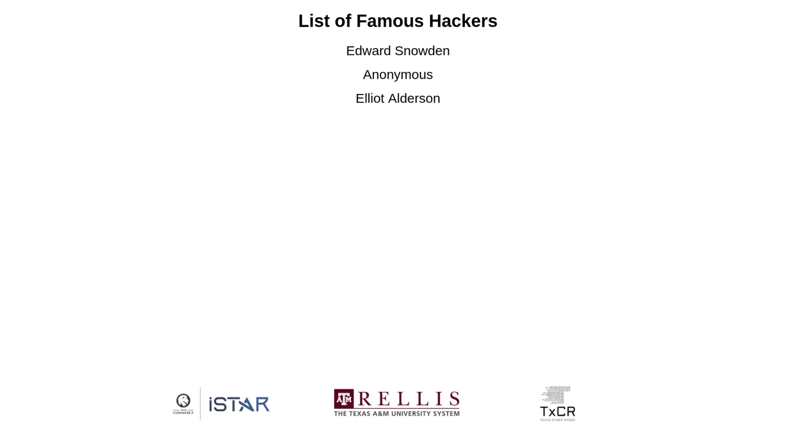
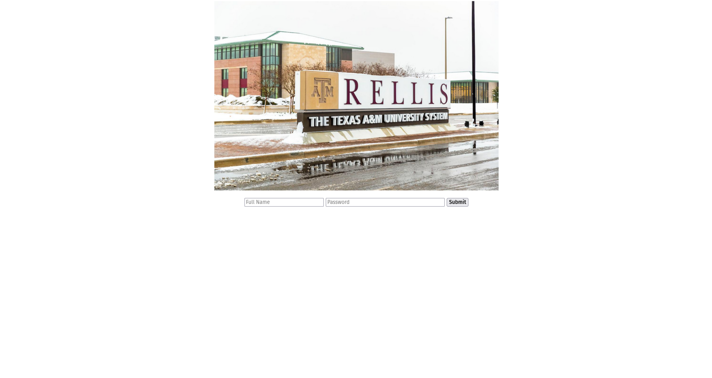

# Engineering Week Challenge

Students will hack their names onto a list of "Famous Hackers"

## Docker Setup

You can use Docker for simplicity instead of the classical setup. Open the directory and just run:

```bash
docker compose up -d
```

If you are running on a Debian based system, it may need to be:

```bash
docker-compose up -d
```

## Setup

Requirements:

- Apache2
- PHP

Unpack this repository in your Apache folder (default: `/var/www/html`). PHP will need permission to read/write the leaderboard.txt file. You can do this with the following command:

```bash
sudo chmod o+w /var/www/html/leaderboard.txt
```

## Usage

After setting this up, students are tasked with going to the IP address (`http://IP_ADDRESS`) and hacking the leaderboard (`http://IP_ADDRESS/leaderboard.php`)

## Pictures

Display this main "leaderboard" on a TV where everyone can see



The final challenge where students will use the skills they've learned with no guidance


