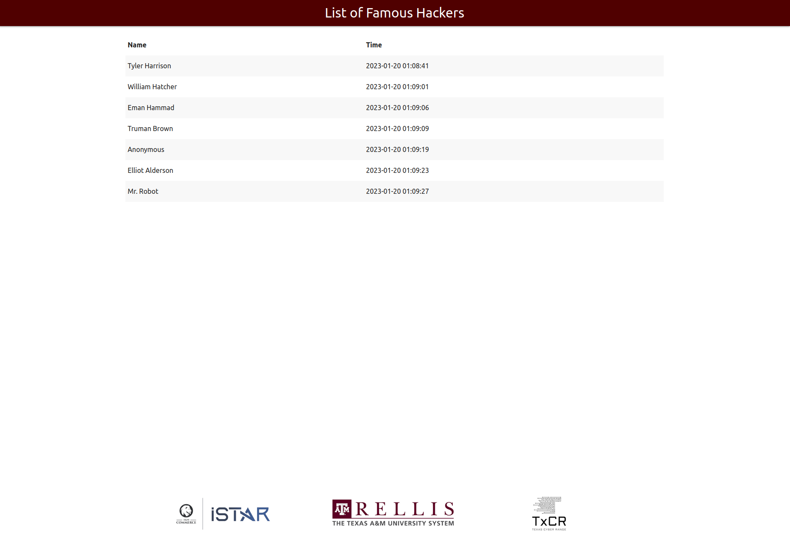
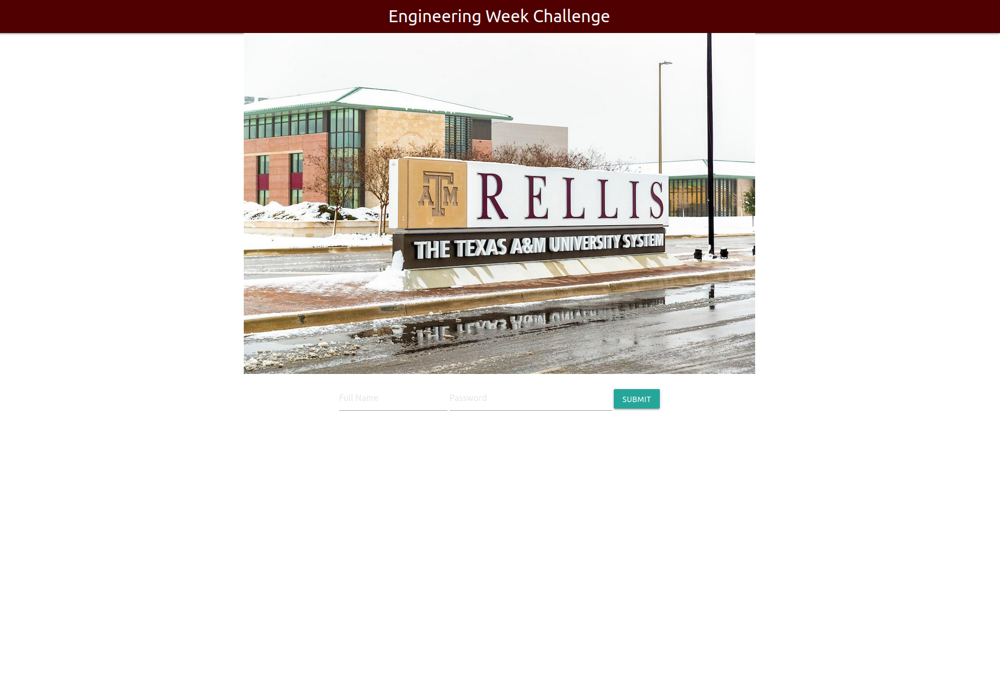
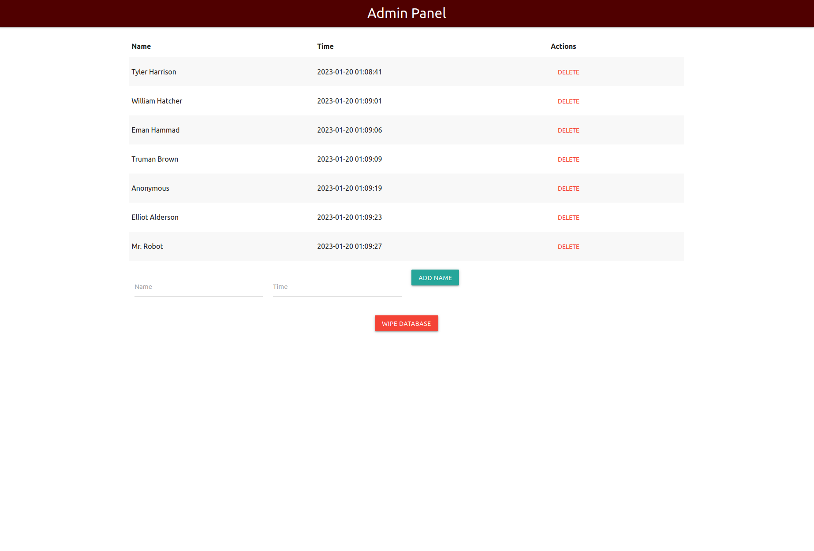

# Engineering Week Challenge

Unlock the secrets of the Cicada 3301 puzzle and sharpen your hacking skills with our latest training exercise. Join us as we delve into the world of steganography, using tools like Outguess to uncover hidden information. Put your newfound knowledge to the test as you compete against your peers to hack your way to the top of our RELLIS "Famous Hackers" leaderboard, displayed on a live TV. Don't miss this exciting opportunity to challenge yourself and prove your hacking prowess.

## Student Resources

Check the [resources](resources/) folder for the PDF document to give to students for initial training.

## Setup

First you must set the environment variables `PASSWORD` and `ADMIN_PASSWORD`. This can be done in a `.env` file or use the session environment (like Portainer env config).

Example `.env` file:

```bash
PASSWORD=ThIs_iS_a_P4ssW0rd
ADMIN_PASSWORD=admin
```

Then open the directory and run this command:

```bash
docker compose up --build -d
```

If you are running on a Debian based system, it may need to be:

```bash
docker-compose up --build -d
```

## Usage

After setting this up, students are tasked with going to the IP address (`http://IP_ADDRESS`) and hacking the leaderboard (`http://IP_ADDRESS/leaderboard`). The admin panel is located at `http://IP_ADDRESS/admin`.

## Pictures

Display this main "leaderboard" on a TV where everyone can see



The final challenge where students will use the skills they've learned with no guidance



The admin panel


